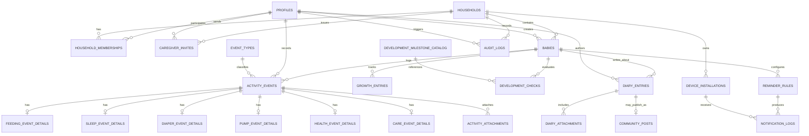

# ERD 상세 설계

작성일: 2026-04-03  
상태: Draft v1  
기술 전제: Flutter + Supabase + Edge Functions

## 1. 목적
이 문서는 BabyDay-Log의 **핵심 데이터 모델(ERD)** 을 상세 정의한다.
목표는 다음 3가지를 동시에 만족하는 것이다.

1. BabyTime 수준의 기록/분석/공유 기능을 커버한다.
2. Supabase + Postgres + RLS 구조에 자연스럽게 맞는다.
3. v1 구현 속도와 장기 확장성의 균형을 맞춘다.

## 2. 공식 문서 기준으로 확정한 전제

### 2.1 사용자 데이터 모델 전제
Supabase 공식 Auth 문서 기준으로:
- `auth.users`는 직접 앱 API에 노출되는 주 업무 테이블로 쓰지 않는다.
- 앱에서는 `public.profiles` 같은 별도 테이블을 만들고 `auth.users`를 FK로 참조하는 구성이 권장된다.
- `user_metadata`는 사용자가 수정할 수 있으므로 **보안/권한 판단에 사용하면 안 된다**.

따라서 우리 서비스의 권한은 반드시 아래 테이블로 관리한다.
- `profiles`
- `households`
- `household_memberships`

### 2.2 구조화 데이터 vs JSONB 전제
Supabase/Postgres 공식 문서 기준으로:
- 가변 구조 데이터는 `jsonb`가 적합하다.
- 하지만 관계형 DB의 강점은 구조화된 컬럼, 조인, 무결성에 있으므로 JSONB를 과도하게 쓰면 안 된다.

따라서 ERD 원칙은 다음과 같다.
- 권한, 집계, 필터링에 중요한 필드는 **정규 컬럼**으로 둔다.
- 드물게 바뀌거나 이벤트 타입별 확장 필드는 **보조 JSONB**로 둔다.

## 3. 협업 모델 3안 검토

### 안 1. 사용자 소유 아기 + 아기별 공동양육자
#### 구조
- `babies.owner_user_id`
- `caregiver_memberships`는 baby 단위

#### 장점
- 단순하다.
- v1 구현이 빠르다.

#### 단점
- 형제자매를 같은 가족 단위로 묶기 어렵다.
- 같은 가족의 여러 아기에 대해 초대를 반복해야 한다.
- 가족 설정(타임존/언어/알림 기본값) 공통 관리가 어렵다.

### 안 2. household 중심 모델
#### 구조
- `households`
- `household_memberships`
- `babies`는 household에 속함

#### 장점
- 가족 단위 협업에 자연스럽다.
- 여러 아기를 한 가족 단위로 묶기 쉽다.
- 공통 설정/초대/권한 관리를 단순화한다.

#### 단점
- v1에 household 개념이 하나 더 생긴다.
- baby 단위 제한 권한이 필요해지면 후속 설계가 필요하다.

### 안 3. household + baby 세부 권한 하이브리드
#### 구조
- household 기본 멤버십 + baby별 override/제한 권한

#### 장점
- 가장 유연하다.

#### 단점
- 초기 복잡도가 크다.
- 지금 단계에서는 과설계 가능성이 높다.

## 4. 최종 선택
**선택: 안 2. household 중심 모델**

### 선택 이유
- BabyTime류 앱의 실제 협업 단위는 “개별 아기”보다 “가족/양육 그룹”에 가깝다.
- 형제자매가 있는 경우 household 모델이 더 자연스럽다.
- Supabase RLS도 household membership을 기준으로 정책을 짜면 단순해진다.

### 단서
- v1은 household 멤버가 household 내 모든 아기에 접근 가능한 것으로 설계한다.
- 추후 baby 단위 제한 권한이 필요해지면 `baby_access_overrides`를 추가한다.

## 5. ERD 설계 원칙
1. 모든 PK는 `uuid`를 사용한다.
2. 모든 시간 컬럼은 기본적으로 `timestamptz`를 사용한다.
3. 앱 권한은 `profiles`, `households`, `household_memberships` 기반으로만 판정한다.
4. 원시 이벤트는 보존하고, 집계는 파생 구조로 분리한다.
5. 삭제는 가능한 한 `deleted_at` 기반 soft delete를 우선 고려한다.
6. 공개 커뮤니티 데이터는 비공개 육아 데이터와 논리적으로 분리한다.

## 6. 핵심 ERD

## 7. 테이블 상세 정의

## 7.1 `profiles`
Supabase 공식 가이드 권장 구조를 따른다.

| 컬럼 | 타입 | 설명 |
|---|---|---|
| id | uuid PK, FK -> auth.users(id) | 사용자 식별자 |
| display_name | text | 앱 표시 이름 |
| avatar_path | text nullable | 프로필 이미지 경로 |
| locale | text | 기본 언어 |
| timezone | text | 기본 시간대 |
| onboarding_completed_at | timestamptz nullable | 온보딩 완료 시각 |
| created_at | timestamptz | 생성 시각 |
| updated_at | timestamptz | 수정 시각 |

### 제약
- `id`는 `auth.users`를 `on delete cascade`로 참조
- RLS 활성화 필수

## 7.2 `households`
가족/양육 그룹 단위의 최상위 협업 컨테이너.

| 컬럼 | 타입 | 설명 |
|---|---|---|
| id | uuid PK | household id |
| name | text | 가족/그룹 이름 |
| locale | text | household 기본 언어 |
| timezone | text | household 기본 시간대 |
| growth_chart_standard | text | 성장 백분위 기준, 기본값 `kr_2017` |
| created_by_user_id | uuid FK -> profiles.id | 생성자 |
| archived_at | timestamptz nullable | 보관 처리 |
| created_at | timestamptz | 생성 시각 |
| updated_at | timestamptz | 수정 시각 |

## 7.3 `household_memberships`
사용자와 household 사이의 권한 관계.

| 컬럼 | 타입 | 설명 |
|---|---|---|
| id | uuid PK | membership id |
| household_id | uuid FK -> households.id | 소속 household |
| user_id | uuid FK -> profiles.id | 사용자 |
| role | membership_role enum | owner/admin/editor/viewer |
| status | membership_status enum | invited/active/disabled/left |
| invited_by_user_id | uuid FK -> profiles.id nullable | 초대자 |
| joined_at | timestamptz nullable | 참여 완료 시각 |
| last_active_at | timestamptz nullable | 최근 활동 |
| created_at | timestamptz | 생성 시각 |
| updated_at | timestamptz | 수정 시각 |

### 유니크 제약
- `(household_id, user_id)` unique

### enum 사용 근거
`membership_role`, `membership_status`는 값 집합이 작고 안정적이므로 enum 사용이 적합하다.

## 7.4 `caregiver_invites`
초대 코드를 통한 household 참여를 관리.

| 컬럼 | 타입 | 설명 |
|---|---|---|
| id | uuid PK | invite id |
| household_id | uuid FK -> households.id | 대상 household |
| invited_role | membership_role enum | 참여 시 부여할 역할 |
| code_hash | text | 초대 코드 해시 |
| expires_at | timestamptz | 만료 시각 |
| max_uses | integer | 사용 가능 횟수 |
| accepted_count | integer | 사용 횟수 |
| status | invite_status enum | active/expired/revoked/consumed |
| invited_by_user_id | uuid FK -> profiles.id | 초대 생성자 |
| accepted_by_user_id | uuid FK -> profiles.id nullable | 마지막 수락자 |
| accepted_at | timestamptz nullable | 마지막 수락 시각 |
| metadata | jsonb | 초대 메모/채널 정보 |
| created_at | timestamptz | 생성 시각 |
| updated_at | timestamptz | 수정 시각 |

## 7.5 `babies`
기록과 분석의 중심 대상.

| 컬럼 | 타입 | 설명 |
|---|---|---|
| id | uuid PK | baby id |
| household_id | uuid FK -> households.id | 소속 household |
| name | text | 이름 |
| birth_at | timestamptz nullable | 출생 시각 |
| birth_date | date | 출생일 |
| sex | baby_sex enum nullable | 성별 |
| due_date | date nullable | 예정일 |
| is_preterm | boolean | 미숙아 여부 |
| avatar_path | text nullable | 프로필 이미지 |
| note | text nullable | 보호자 메모 |
| archived_at | timestamptz nullable | 보관 처리 |
| created_by_user_id | uuid FK -> profiles.id | 생성자 |
| created_at | timestamptz | 생성 시각 |
| updated_at | timestamptz | 수정 시각 |

### 비고
- `birth_date`는 연령 계산, `birth_at`은 세밀한 기록/차트 정밀도용으로 분리한다.

## 7.6 `event_types`
이벤트 종류 사전 테이블.

| 컬럼 | 타입 | 설명 |
|---|---|---|
| slug | text PK | 예: breastfeeding, sleep, diaper |
| category | text | feeding, sleep, diaper, health, care |
| display_name | text | 관리자/분석용 표시명 |
| is_timer_supported | boolean | 타이머 지원 여부 |
| is_quantity_supported | boolean | 수량 지원 여부 |
| is_enabled | boolean | 활성 여부 |
| sort_order | integer | 정렬 |
| created_at | timestamptz | 생성 시각 |
| updated_at | timestamptz | 수정 시각 |

### 왜 enum이 아닌가?
Supabase/Postgres 공식 문서상 enum은 값이 작고 고정된 경우에 적합하다.  
`event_type`은 제품 진화에 따라 늘어날 가능성이 높으므로 **lookup table**이 더 안전하다.

## 7.7 `activity_events`
타임라인과 동기화의 기준이 되는 공통 이벤트 테이블.

| 컬럼 | 타입 | 설명 |
|---|---|---|
| id | uuid PK | 이벤트 id |
| household_id | uuid FK -> households.id | household 범위 |
| baby_id | uuid FK -> babies.id | 대상 아기 |
| actor_user_id | uuid FK -> profiles.id | 기록한 사용자 |
| event_type_slug | text FK -> event_types.slug | 이벤트 종류 |
| status | event_status enum | draft/running/completed/cancelled |
| source | event_source enum | app/widget/watch/shortcut/import/system |
| started_at | timestamptz nullable | 시작 시각 |
| ended_at | timestamptz nullable | 종료 시각 |
| recorded_at | timestamptz | 사용자가 기록한 기준 시각 |
| note | text nullable | 메모 |
| metadata | jsonb | 비핵심 가변 필드 |
| client_uid | uuid nullable | 클라이언트 idempotency 키 |
| deleted_at | timestamptz nullable | soft delete |
| created_at | timestamptz | 생성 시각 |
| updated_at | timestamptz | 수정 시각 |

### 인덱스 권장
- `(baby_id, recorded_at desc)`
- `(household_id, created_at desc)`
- `(event_type_slug, recorded_at desc)`
- `client_uid unique where client_uid is not null`

## 7.8 세부 이벤트 테이블
아래 테이블은 `activity_events.id`를 PK이자 FK로 사용한다.

### `feeding_event_details`
| 컬럼 | 타입 | 설명 |
|---|---|---|
| event_id | uuid PK/FK | base event |
| feeding_mode | text | breast/bottle/solid/snack |
| breast_side | text nullable | left/right/both |
| left_duration_sec | integer nullable | 좌측 수유 시간 |
| right_duration_sec | integer nullable | 우측 수유 시간 |
| amount_value | numeric nullable | 양 |
| amount_unit | text nullable | ml / oz / g |
| content_type | text nullable | formula / breast_milk / mixed / solid |
| spit_up_level | smallint nullable | 역류 정도 |
| metadata | jsonb | 비핵심 추가 정보 |

### `sleep_event_details`
| 컬럼 | 타입 | 설명 |
|---|---|---|
| event_id | uuid PK/FK | base event |
| sleep_type | text | nap / night |
| location | text nullable | 침대/유모차 등 |
| fell_asleep_at | timestamptz nullable | 실제 수면 시작 시각 |
| woke_up_at | timestamptz nullable | 실제 기상 시각 |
| metadata | jsonb | 추가 정보 |

### `diaper_event_details`
| 컬럼 | 타입 | 설명 |
|---|---|---|
| event_id | uuid PK/FK | base event |
| diaper_type | text | wet / dirty / mixed / dry |
| stool_color | text nullable | 색상 |
| stool_texture | text nullable | 묽음/보통 등 |
| rash_observed | boolean | 발진 여부 |
| metadata | jsonb | 추가 정보 |

### `pump_event_details`
| 컬럼 | 타입 | 설명 |
|---|---|---|
| event_id | uuid PK/FK | base event |
| left_amount_ml | numeric nullable | 좌측 유축량 |
| right_amount_ml | numeric nullable | 우측 유축량 |
| left_duration_sec | integer nullable | 좌측 시간 |
| right_duration_sec | integer nullable | 우측 시간 |
| total_amount_ml | numeric nullable | 총량 캐시 |
| metadata | jsonb | 추가 정보 |

### `health_event_details`
| 컬럼 | 타입 | 설명 |
|---|---|---|
| event_id | uuid PK/FK | base event |
| health_type | text | temperature / medication / symptom / vaccination / doctor_visit |
| temperature_c | numeric nullable | 체온은 섭씨 표준 저장 |
| medication_name | text nullable | 약 이름 |
| dosage_value | numeric nullable | 투여량 |
| dosage_unit | text nullable | ml / mg / tablet |
| symptom_summary | text nullable | 증상 요약 |
| clinic_name | text nullable | 병원명 |
| diagnosis | text nullable | 진단 내용 |
| metadata | jsonb | 추가 정보 |

### `care_event_details`
| 컬럼 | 타입 | 설명 |
|---|---|---|
| event_id | uuid PK/FK | base event |
| care_type | text | bath / tummy_time / walk / play / custom |
| duration_sec | integer nullable | 지속 시간 |
| quantity_value | numeric nullable | 부가 수량 |
| quantity_unit | text nullable | 단위 |
| metadata | jsonb | 추가 정보 |

## 7.9 `activity_attachments`
이벤트 첨부 미디어 메타데이터.

| 컬럼 | 타입 | 설명 |
|---|---|---|
| id | uuid PK | attachment id |
| event_id | uuid FK -> activity_events.id | 연결 이벤트 |
| storage_bucket | text | 버킷명 |
| storage_path | text | 파일 경로 |
| mime_type | text | MIME |
| size_bytes | bigint | 파일 크기 |
| width | integer nullable | 이미지 폭 |
| height | integer nullable | 이미지 높이 |
| created_by_user_id | uuid FK -> profiles.id | 업로더 |
| created_at | timestamptz | 생성 시각 |

## 7.10 `growth_entries`
성장 측정은 활동 이벤트와 분리된 전용 테이블로 관리한다.

| 컬럼 | 타입 | 설명 |
|---|---|---|
| id | uuid PK | 성장 기록 id |
| baby_id | uuid FK -> babies.id | 대상 아기 |
| actor_user_id | uuid FK -> profiles.id | 기록자 |
| measured_at | timestamptz | 측정 시각 |
| weight_kg | numeric nullable | 체중 |
| height_cm | numeric nullable | 키 |
| head_circumference_cm | numeric nullable | 머리둘레 |
| percentile_source | text nullable | 기준표 버전 |
| note | text nullable | 메모 |
| created_at | timestamptz | 생성 시각 |
| updated_at | timestamptz | 수정 시각 |
| deleted_at | timestamptz nullable | soft delete |

## 7.11 `development_milestone_catalog`
월령별 발달 체크 마스터 데이터.

| 컬럼 | 타입 | 설명 |
|---|---|---|
| id | uuid PK | 항목 id |
| milestone_group | text | gross_motor / language / social 등 |
| min_month | integer | 시작 월령 |
| max_month | integer | 종료 월령 |
| title | text | 항목명 |
| description | text | 설명 |
| sort_order | integer | 정렬 |
| is_active | boolean | 사용 여부 |

## 7.12 `development_checks`
실제 아기별 체크 결과.

| 컬럼 | 타입 | 설명 |
|---|---|---|
| id | uuid PK | check id |
| baby_id | uuid FK -> babies.id | 대상 아기 |
| milestone_id | uuid FK -> development_milestone_catalog.id | 기준 항목 |
| checked_by_user_id | uuid FK -> profiles.id | 기록자 |
| checked_at | timestamptz | 체크 시각 |
| status | text | achieved / observing / not_yet |
| note | text nullable | 메모 |
| created_at | timestamptz | 생성 시각 |
| updated_at | timestamptz | 수정 시각 |

### 유니크 후보
- `(baby_id, milestone_id)` unique

## 7.13 `diary_entries`
비공개 성장일기 원본.

| 컬럼 | 타입 | 설명 |
|---|---|---|
| id | uuid PK | diary id |
| household_id | uuid FK -> households.id | household 범위 |
| baby_id | uuid FK -> babies.id | 대상 아기 |
| author_user_id | uuid FK -> profiles.id | 작성자 |
| title | text nullable | 제목 |
| body | text | 본문 |
| visibility | diary_visibility enum | private / household / public_pending / public |
| event_date | date nullable | 일기 대표 날짜 |
| published_at | timestamptz nullable | 공개 시각 |
| deleted_at | timestamptz nullable | soft delete |
| created_at | timestamptz | 생성 시각 |
| updated_at | timestamptz | 수정 시각 |

## 7.14 `diary_attachments`
일기 첨부 미디어 메타데이터.

| 컬럼 | 타입 | 설명 |
|---|---|---|
| id | uuid PK | attachment id |
| diary_entry_id | uuid FK -> diary_entries.id | 연결 일기 |
| storage_bucket | text | 버킷명 |
| storage_path | text | 파일 경로 |
| mime_type | text | MIME |
| size_bytes | bigint | 크기 |
| sort_order | integer | 정렬 |
| created_at | timestamptz | 생성 시각 |

## 7.15 `community_posts`
공개 커뮤니티 피드용 파생 엔티티.

| 컬럼 | 타입 | 설명 |
|---|---|---|
| id | uuid PK | post id |
| diary_entry_id | uuid FK -> diary_entries.id unique | 원본 일기 |
| author_user_id | uuid FK -> profiles.id | 작성자 |
| household_id | uuid FK -> households.id | 소속 household |
| baby_age_days | integer | 공개 시점 기준 D+day |
| status | community_post_status enum | visible / hidden / flagged / removed |
| published_at | timestamptz | 공개 시각 |
| moderated_at | timestamptz nullable | 운영 처리 시각 |
| moderation_reason | text nullable | 사유 |
| created_at | timestamptz | 생성 시각 |
| updated_at | timestamptz | 수정 시각 |

## 7.16 `reminder_rules`
알림 규칙.

| 컬럼 | 타입 | 설명 |
|---|---|---|
| id | uuid PK | rule id |
| baby_id | uuid FK -> babies.id | 대상 아기 |
| household_id | uuid FK -> households.id | household 범위 |
| rule_type | reminder_rule_type enum | feeding / sleep / diaper / medication |
| is_enabled | boolean | 활성 여부 |
| threshold_minutes | integer | 기준 시간 |
| quiet_hours_json | jsonb nullable | 조용한 시간대 |
| created_by_user_id | uuid FK -> profiles.id | 생성자 |
| created_at | timestamptz | 생성 시각 |
| updated_at | timestamptz | 수정 시각 |

## 7.17 `device_installations`
푸시/알림/디바이스 컨텍스트.

| 컬럼 | 타입 | 설명 |
|---|---|---|
| id | uuid PK | device id |
| household_id | uuid FK -> households.id | household |
| user_id | uuid FK -> profiles.id | 사용자 |
| platform | text | ios / android |
| push_token | text nullable | 푸시 토큰 |
| locale | text | 디바이스 로캘 |
| timezone | text | 디바이스 시간대 |
| app_version | text | 앱 버전 |
| is_active | boolean | 활성 여부 |
| created_at | timestamptz | 생성 시각 |
| updated_at | timestamptz | 수정 시각 |

## 7.18 `notification_logs`
실제 발송 내역과 상태.

| 컬럼 | 타입 | 설명 |
|---|---|---|
| id | uuid PK | log id |
| reminder_rule_id | uuid FK -> reminder_rules.id nullable | 규칙 기반 알림 |
| device_installation_id | uuid FK -> device_installations.id | 수신 디바이스 |
| notification_type | text | reminder / invite / sync_issue |
| payload | jsonb | 발송 payload |
| status | text | queued / sent / failed / opened |
| sent_at | timestamptz nullable | 발송 시각 |
| opened_at | timestamptz nullable | 열람 시각 |
| created_at | timestamptz | 생성 시각 |

## 7.19 `audit_logs`
권한, 공개 전환, 초대, 삭제 같은 민감한 변화 추적.

| 컬럼 | 타입 | 설명 |
|---|---|---|
| id | uuid PK | audit id |
| household_id | uuid FK -> households.id | household 범위 |
| actor_user_id | uuid FK -> profiles.id nullable | 수행자 |
| entity_type | text | baby / event / diary / membership |
| entity_id | uuid | 대상 식별자 |
| action | text | create / update / delete / publish / invite_accept |
| before_json | jsonb nullable | 변경 전 |
| after_json | jsonb nullable | 변경 후 |
| created_at | timestamptz | 생성 시각 |

## 8. v1 핵심 테이블과 후속 테이블 구분

### v1 핵심 구현 대상
- `profiles`
- `households`
- `household_memberships`
- `caregiver_invites`
- `babies`
- `event_types`
- `activity_events`
- `feeding_event_details`
- `sleep_event_details`
- `diaper_event_details`
- `health_event_details`
- `growth_entries`
- `reminder_rules`
- `device_installations`

### v1.5 ~ 후속 확장
- `pump_event_details`
- `care_event_details`
- `development_milestone_catalog`
- `development_checks`
- `diary_entries`
- `diary_attachments`
- `community_posts`
- `notification_logs`
- `audit_logs`

## 9. 이 ERD의 결론
- 협업 모델은 **household 중심**으로 간다.
- 권한은 `household_memberships` 중심으로 관리한다.
- 육아 로그는 `activity_events` + 세부 테이블로 관리한다.
- 성장/일기/커뮤니티는 육아 이벤트와 분리된 별도 도메인으로 유지한다.

## 10. 관련 문서
- `docs/architecture/event-schema.md`
- `docs/architecture/supabase-architecture.md`
- `docs/plan/user-flows.md`

## 11. 참고 출처
- Supabase User Management: https://supabase.com/docs/guides/auth/managing-user-data
- Supabase Users: https://supabase.com/docs/guides/auth/users
- Supabase Auth: https://supabase.com/docs/guides/auth
- Supabase JSON / JSONB: https://supabase.com/docs/guides/database/json
- Supabase Enums: https://supabase.com/docs/guides/database/postgres/enums
- Supabase Tables and Data: https://supabase.com/docs/guides/database/tables
